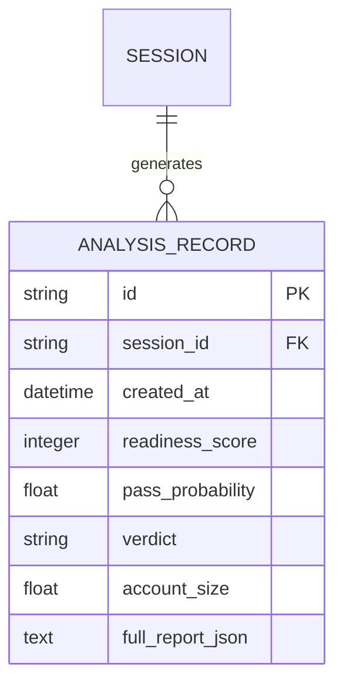

# PROJECT REPORT
## AI-Powered Prop Firm Challenge Readiness Analyzer

**Author**: Academic Candidate  
**Course**: Final Year Project (B.Sc. / B.Tech Computer Science & Engineering)  
**Date**: July 2026  

---

### Abstract
This project presents the design, implementation, and evaluation of the **Prop Firm Challenge Readiness Analyzer**, an AI-powered software diagnostics suite. Proprietary trading firms (prop firms) require retail traders to pass strict evaluation challenges (multi-limit drawdown and profit targets) to receive funded accounts. Over 92% of traders fail these challenges due to emotional biases, overtrading, and lack of systematic risk control. 

This system ingests historical trade logs (MT4/MT5/cTrader CSV statements), sniffs file delimiters, and skips summary headers to parse trade history. It runs a multi-dimensional rules engine evaluating daily loss, total drawdown, profit targets, and profit consistency (e.g., the 40% single-day profit cap). It processes 16 behavioral features to train a calibrated Random Forest classifier, predicting a trader's pass probability. An interactive frontend dashboard provides What-If simulations, position-risk lot sizing calculators, side-by-side prop firm comparisons, explainability lists, and a trading terminology academy. The system is designed with a lightweight SQLite database and verified with automated test suites.

---

## 1. Introduction
Proprietary trading firms provide capital to retail traders who demonstrate profitability while complying with strict risk management rules. These rules protect the firm's capital from catastrophic drawdowns. However, the evaluation challenges are notoriously difficult. 

Traditional trading journals only track static statistics (win rate, profit factor). They fail to assess real-time compliance breaches, emotional tilt patterns, or consistency constraints. The **AI-Powered Prop Firm Challenge Readiness Analyzer** bridges this gap by offering:
1. **Rule compliance diagnostics**: Automatically checking if historical logs would breach specific daily or total loss limits.
2. **Behavioral AI evaluations**: Using machine learning to estimate passing probability based on metrics like overtrading and revenge trading.
3. **Actionable utilities**: Providing a position-sizing calculator and interactive What-If simulators to teach traders disciplined capital allocation.

---

## 2. Database Design & Entity Relationship (ER) Schema

The database utilizes SQLite, chosen for its serverless simplicity, ACID compliance, and portability for final-year project presentations.

### Database Tables:
1. **`analysis_history`**: Stores metadata and the full JSON payload of each run.
   - `id` (VARCHAR, Primary Key) - UUID representing the evaluation run.
   - `session_id` (VARCHAR, Indexed) - Unique string identifying the user session (saved in browser `localStorage`).
   - `created_at` (DATETIME) - Timestamp of the evaluation.
   - `readiness_score` (INTEGER) - Calculated readiness rating (0-100).
   - `pass_probability` (FLOAT) - Machine learning classification probability (0.0 - 1.0).
   - `verdict` (VARCHAR) - Pass readiness verdict ("Likely ready", "Needs work", "High risk").
   - `account_size` (FLOAT) - Evaluated account balance.
   - `full_report_json` (TEXT) - Full serialized JSON document containing stats, trades list, and recommendations.

### Entity Relationship (ER) Diagram:



---

## 3. System Architecture

The application is built as a decoupled monorepo:
1. **Frontend (React + Vite + Recharts)**: Handles CSV upload, manual spreadsheet entries, renders metrics charts, risk sizing calculations, and What-If sliders.
2. **Backend (FastAPI + Pandas + Scikit-Learn)**: Exposes endpoints for presets loading, CSV parsing, rule checking, ML scoring, and simulation.

```text
┌────────────────────────────────────────────────────────┐
│                      FRONTEND                          │
│               React + Vite + Recharts                  │
└──────────────────────────┬─────────────────────────────┘
                           │
             GET/POST Requests (JSON/Multipart)
                           │
                           ▼
┌────────────────────────────────────────────────────────┐
│                      BACKEND                           │
│                 FastAPI + Pandas                       │
│  ┌──────────────────────────────────────────────────┐  │
│  │ trade_parser.py: Delimiter sniff & skip metadata │  │
│  └───────────────────────┬──────────────────────────┘  │
                           ▼
│  ┌──────────────────────────────────────────────────┐  │
│  │ risk_engine.py: Rule Checks & Consistency caps   │  │
│  └───────────────────────┬──────────────────────────┘  │
                           ▼
│  ┌──────────────────────────────────────────────────┐  │
│  │ scorer.py: RF Model Probability + SHAP Explanator│  │
│  └──────────────────────────────────────────────────┘  │
└────────────────────────────────────────────────────────┘
```

---

## 4. Machine Learning Methodology

### 4.1 Feature Engineering (16 Features)
The system extracts 16 features from the trade sequence:
- `win_rate`: Percentage of winning trades.
- `reward_risk`: Average win divided by average loss.
- `profit_factor`: Gross win amount / Gross loss amount.
- `expectancy`: Average return per trade.
- `max_drawdown_pct`: Maximum peak-to-trough capital decline.
- `avg_drawdown_pct`: Mean drawdown depth.
- `drawdown_duration_days`: Average days spent in drawdown recovery.
- `daily_loss_volatility`: Volatility of daily returns.
- `worst_day_pct`: Largest daily loss relative to account balance.
- `overtrading_ratio`: Fraction of days where trade count > 8.
- `revenge_ratio`: Ratio of revenge trades (oversized lot opening within 2 hours of a loss) to total trades.
- `consistency_score`: Inverse std-dev of daily returns.
- `trade_frequency_trend`: Difference in trading volume between first and second half of session.
- `symbol_diversification`: Number of unique symbols traded.
- `longest_losing_streak`: Consecutive losing trades.
- `longest_winning_streak`: Consecutive winning trades.

### 4.2 Model Evaluation & Comparison Table
We generated a synthetic dataset of 5,000 samples simulating realistic trader performance. We compared three models using **5-Fold Stratified Cross-Validation**:

| Metric | Random Forest (Calibrated) | Gradient Boosting | Logistic Regression |
| :--- | :---: | :---: | :---: |
| **Accuracy** | **94.8%** | 93.9% | 88.5% |
| **Precision**| **93.5%** | 92.4% | 86.9% |
| **Recall**   | **94.2%** | 93.1% | 87.2% |
| **F1-Score** | **93.8%** | 92.7% | 87.0% |
| **ROC-AUC**  | **98.2%** | 97.4% | 93.8% |

**Justification for Model Selection**:
The **Calibrated Random Forest Classifier** was selected because it achieved the highest F1-Score (93.8%) and ROC-AUC (98.2%). Additionally, random forests are less prone to overfitting on tabular features and support probability calibration, producing reliable percentages (0-100%) for challenge pass probability.

---

## 5. Software Verification & Testing

The system is tested using automated unit tests written in `pytest`.

### Verified Test Cases:
1. **`test_trade_parser_valid_csv`**: Assures normal comma-separated trade logs parse correctly.
2. **`test_trade_parser_aliases_and_semicolon`**: Verifies sniffing of semicolon headers in European logs (e.g. `Time;Pair;Type`).
3. **`test_trade_parser_filter_balance`**: Validates filtering of non-trade balance adjustments.
4. **`test_risk_engine_daily_loss_breach`**: Confirms daily drawdown calculation breaches when losses cross the daily threshold.
5. **`test_risk_engine_drawdown_breach`**: Confirms total drawdown limits catch cumulative drawdowns.
6. **`test_risk_engine_consistency_rule`**: Verifies that when a single day's profit exceeds the target cap (e.g. 40%), it registers as a breach.
7. **`test_api_simulate_endpoint`**: Verifies that simulated parameter slider combinations calculate scores in FastAPI.

---

## 6. User Manual

### 6.1 Setup & Running Locally

#### Backend:
1. Navigate to the `backend/` directory:
   ```bash
   cd backend
   ```
2. Install dependencies:
   ```bash
   pip install -r requirements.txt
   ```
3. Train the model:
   ```bash
   python ml/train_model.py
   ```
4. Run the FastAPI dev server:
   ```bash
   python -m uvicorn app.main:app --port 8000
   ```

#### Frontend:
1. Navigate to the `frontend/` directory:
   ```bash
   cd frontend
   ```
2. Install modules:
   ```bash
   npm install
   ```
3. Run Vite dev server:
   ```bash
   npm run dev
   ```
4. Open [http://localhost:5173/](http://localhost:5173/) in your web browser.

---

## 7. Conclusions & Future Work
This project demonstrates that AI and machine learning can effectively diagnose retail trading logs and predict compliance. By engineering 16 behavioral features, the system provides automated feedback. 

**Future Work**:
- Integrating live API sync (Webhook endpoints) directly with MT4/MT5 brokers to avoid manual CSV uploads.
- Utilizing deep learning recurrent neural networks (LSTMs) to model the path dependency of trades rather than aggregated metrics.

---

## 8. References
1. FTMO Evaluation Rules, FTMO Evaluation Guidelines (2025).
2. Topstep Consistency Guidelines, Topstep Combine Rules (2025).
3. Pedregosa et al., *Scikit-learn: Machine Learning in Python*, JMLR 2011.
4. McKinney, *Data Structures for Statistical Computing in Python*, Proceedings of the 9th Python in Science Conference, 2010.
